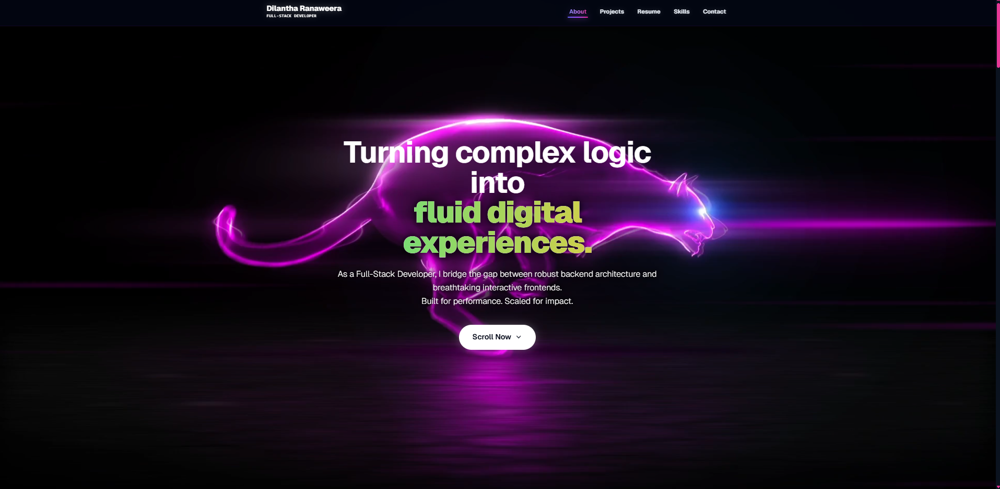
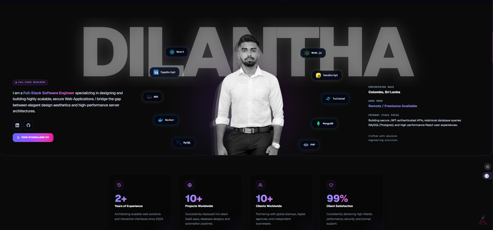
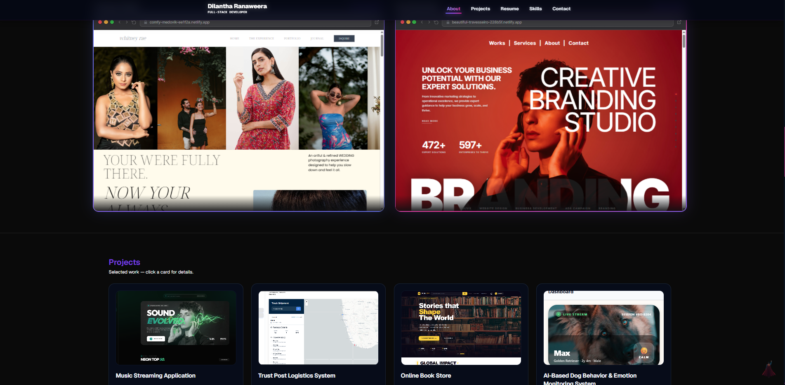

# 🌌 Immersive 3D Developer Portfolio

A premium, interactive, and high-performance developer portfolio website designed to stand out. Built with **React 19**, **TypeScript**, **Vite 7**, and **Tailwind CSS v4**, this portfolio leverages modern web technologies like **Three.js** (for 3D graphics), **GSAP** (for high-end scroll orchestration), and **Framer Motion** to deliver a premium user experience.

Developed by **Dilantha Ranaweera** (Full-Stack Developer).

---

## 🔗 Live Demo & Links

*   **Live Site:** [comfy-medovik-ee1f2a.netlify.app](https://comfy-medovik-ee1f2a.netlify.app/)
*   **LinkedIn:** [linkedin.com/in/pramuditha-ranaweera](https://linkedin.com/in/pramuditha-ranaweera)
*   **GitHub:** [github.com/Dilantha2001](https://github.com/Dilantha2001)
*   **Email:** [pramudithadilantha89@gmail.com](mailto:pramudithadilantha89@gmail.com)

---

## 📸 Visual Showcase

### 🏠 Hero Section & 3D Interactive Background
Featuring an animated landing page with a Three.js-powered 3D Hyperspeed particle tunnel, interactive fluid mouse trailing (Splash Cursor), and dynamic scroll reveals.


### 📊 Skills & Expertise Visualization
Interactive components displaying technological proficiencies, framework usage, and backend/frontend split with custom visual animations.


### 💻 Interactive CLI Resume
A fully interactive, command-line terminal emulator widget allowing visitors to type commands (like `help`, `about`, `skills`, `projects`, `clear`) to view resume details in a developer-native format.


---

## ⚡ Key Features

*   🌌 **3D Three.js Hyperspeed Highway**: A custom 3D particle tunnel effect rendering seamlessly in the background and responding to user scrolls.
*   🖱️ **Splash Cursor**: An interactive particle cursor trailing effect tracking the pointer with physics-based movement.
*   💻 **Interactive CLI Terminal**: A simulated developer console that accepts CLI commands to display portfolio sections.
*   📱 **Embedded Browser Mockups**: Custom desktop and mobile style browser mockup wrappers for project previews and links.
*   🎭 **GSAP ScrollTrigger Pinned Sections**: Entrance animations, pinned scrolling project showcases, and split-type text reveal effects.
*   💫 **Lenis Smooth Scrolling**: Seamless scrolling dynamics optimized across all browsers and devices.
*   🌓 **Theme System**: Full light/dark mode support mapped via custom CSS variables and Tailwind utilities.
*   📧 **Dynamic Contact Portal**: Interactive contact form with live validation and success handling.

---

## 🛠️ Technology Stack

| Category | Technologies Used |
| :--- | :--- |
| **Core Framework** | React 19, TypeScript, Vite 7 |
| **Styling & Layout** | Tailwind CSS v4, Radix UI, Class Variance Authority (`cva`) |
| **Animations** | GSAP (GreenSock), ScrollTrigger, Framer Motion, Split-Type |
| **3D Graphics & Effects** | Three.js, Postprocessing, Custom Shaders |
| **Utility Packages** | Lenis, Lucide React, Iconify React, React Router Dom, React Scroll |

---

## 📁 Project Directory Structure

```text
portfolio/
├── screenshots/          # Embedded repository images
├── src/
│   ├── components/       # UI & Page Layout Components
│   │   ├── ui/           # Core animated canvas components (Hyperspeed, etc.)
│   │   ├── shared/       # Navigation, Footer, Scroll Reveal wrappers
│   │   ├── sections/     # Core content pages (About, Projects, Contact, FAQ)
│   │   └── CLIResume.tsx # Interactive terminal component
│   ├── config/
│   │   └── portfolioData.ts # Centralized content and developer details configuration
│   ├── types/            # TypeScript interfaces
│   ├── pages/            # Main application layouts
│   └── App.tsx           # React root component entry
├── public/               # Static assets (images, resume PDF)
├── vite.config.ts        # Vite configuration
└── package.json          # Dependency and build scripts
```

---

## ⚙️ Quick Start

### 1. Clone the repository
```bash
git clone https://github.com/Dilantha2001/portfolio.git
cd portfolio
```

### 2. Install dependencies
```bash
npm install
```

### 3. Start the local development server
```bash
npm run dev
```
Open `http://localhost:5173` (or the fallback local URL provided by Vite) in your browser.

### 4. Build for production
```bash
npm run build
```
This outputs static assets optimized for production inside the `dist/` directory.

---

## ✏️ Personalization & Customization Guide

You can easily adapt this portfolio for your own details! All the text content, project descriptions, skills list, experience timeline, and social handles are centralized in a single configuration file.

Open and modify [src/config/portfolioData.ts](file:///c:/Users/Dilantha/Documents/GitHub/portfolio/src/config/portfolioData.ts):

```typescript
export const PORTFOLIO_INFO: Portfolio = {
  meta: {
    url: "https://yourdomain.dev",
    pdf: "/resume.pdf",
  },
  personal: {
    name: "Your Name",
    title: "Your Specialization",
    headline: "Keywords · Tech · Focus",
    summary: "Brief intro summary about yourself...",
    contact: {
      email: "your.email@example.com",
      phone: "+94 XX XXX XXXX",
      location: "City, Country",
      socials: [
        { label: "LinkedIn", url: "https://linkedin.com/in/yourprofile", icon: "SiLinkedin" },
        { label: "GitHub", url: "https://github.com/yourgithub", icon: "SiGithub" }
      ]
    }
  },
  skills: [ /* Your skills grouped by categories */ ],
  experience: [ /* Your work history */ ],
  projects: [ /* Your projects details, tags, images, and github links */ ],
  education: [ /* Your degrees and schools */ ],
  certifications: [ /* Your course accomplishments */ ]
};
```

---

## 🚀 Deployment

### GitHub Pages
This project is pre-configured with a deployment script utilizing the `gh-pages` library. Run:
```bash
npm run deploy
```

### Netlify / Vercel
Simply import the repository to Netlify or Vercel:
- **Build Command:** `npm run build`
- **Publish Directory:** `dist`

---

## 📄 License

This project is open-source and available under the [MIT License](LICENSE.md).
